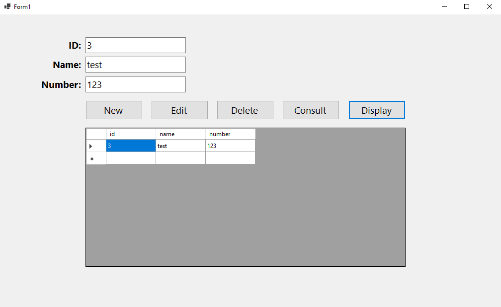

<h1 align="center">CRUD with C#</h1>

A simple example of CRUD using C#

 

     
    
    
    
    
    

 

    <a href="#-about-the-project">About the project</a> •
    <a href="#-license">License</a> •
    <a href="#-contact">Contact</a> 

## 💻 About the project

I did this project with the purpose of practicing and exercising my skills in both C# and SQL. As such, the project contains the essential methods for a CRUD (Create, Retrieve, Update and Delete) operation.
 

 

### Built with
Apart from C#, I used the following tools to build this project.

- [VisualStudio 2019][visualstudio]
- [MySql][mysql]

## 📃 License

Distributed under the MIT License. See [LICENSE](./LICENSE) for more information.

## 🌟 Contact

Hey :D

If you wanna get in touch, fell free to contact me at:

[LinkedIn][linkedin]

---

Made by Venicio Augusto 

<!-- LINKS-->

[visualstudio]: https://visualstudio.microsoft.com/vs/
[mysql]: https://www.mysql.com/

[linkedin]: https://www.linkedin.com/in/venicio-augusto/